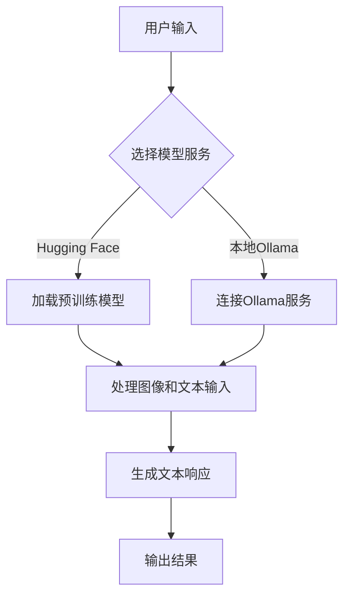
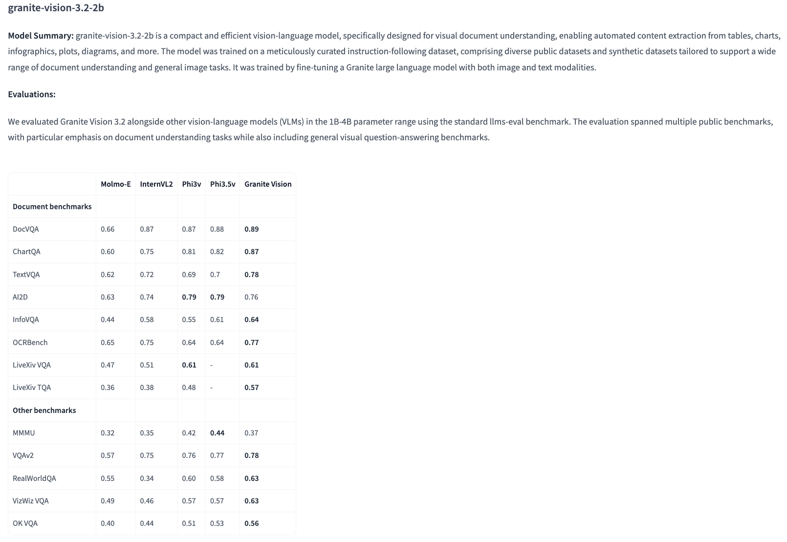
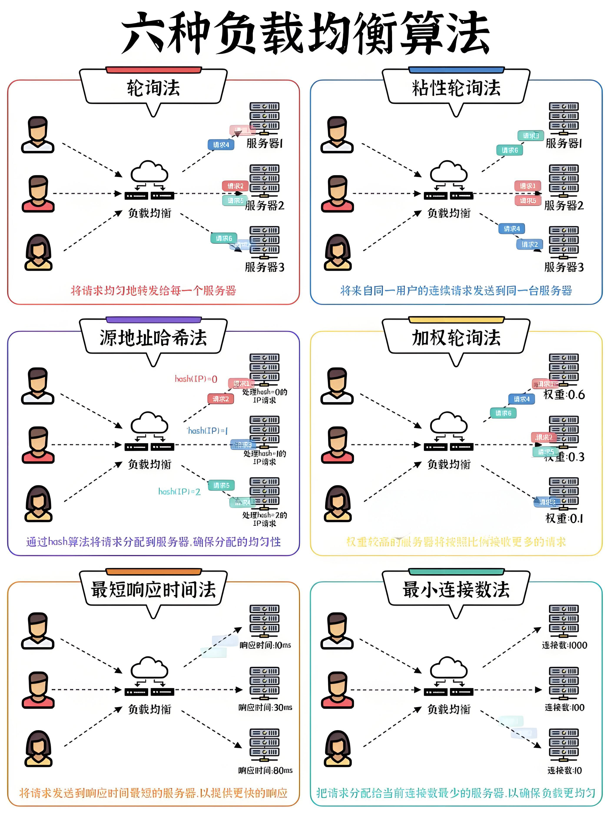
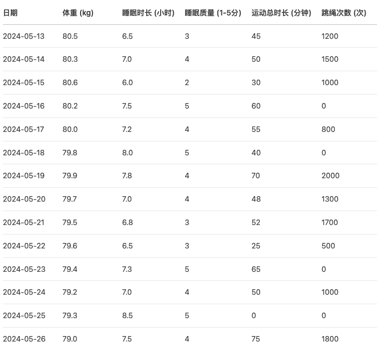

# 多模型图像文本转换项目技术方案文档

## 项目概述

本项目旨在实现基于图像的文本转换功能，通过调用不同的模型服务（Hugging Face和本地Ollama服务）来分析图像内容并回答相关问题。项目支持多种图像类型，包括图表、表格和普通图片，并提供了灵活的接口供用户扩展。

## 技术架构



## 环境要求

- Python 3.8+
- 依赖库：
  - transformers
  - huggingface_hub
  - torch
  - ollama
  - matplotlib (可选，用于图像显示)

## 快速开始

### 安装依赖
```bash
pip install transformers huggingface_hub torch ollama
```

### 下载模型
- Hugging Face模型会自动下载
- Ollama模型需要手动下载：
```bash
ollama pull granite3.2-vision
```

### 运行示例
```bash
# 运行Hugging Face版本
python text_image_to_text_google_gamma.py

# 运行Ollama版本
python text_image_to_text_ollama_granite.py
```

## 代码实现详解

### 1. Hugging Face版本 (text_image_to_text_google_gamma.py)

此版本使用Hugging Face的预训练模型`ibm-granite/granite-vision-3.2-2b`，适合需要高精度分析的场景。

```python
from transformers import AutoProcessor, AutoModelForVision2Seq
from huggingface_hub import hf_hub_download
import torch

device = "cuda" if torch.cuda.is_available() else "cpu"

# 模型路径
model_path = "ibm-granite/granite-vision-3.2-2b"
processor = AutoProcessor.from_pretrained(model_path)
model = AutoModelForVision2Seq.from_pretrained(model_path).to(device)

# 下载示例图片
img_path = hf_hub_download(repo_id=model_path, filename='example.png')

# 准备对话内容
conversation = [
    {
        "role": "user",
        "content": [
            {"type": "image", "url": img_path},
            {"type": "text", "text": "What is the highest scoring model on ChartQA and what is its score?"},
        ],
    },
]

# 处理输入
inputs = processor.apply_chat_template(
    conversation,
    add_generation_prompt=True,
    tokenize=True,
    return_dict=True,
    return_tensors="pt"
).to(device)

# 生成输出
output = model.generate(**inputs, max_new_tokens=100)
print(processor.decode(output[0], skip_special_tokens=True))
```

### 2. Ollama版本 (text_image_to_text_ollama_granite.py)

此版本使用本地Ollama服务，支持多种图像类型和批量处理，适合需要快速部署和本地运行的场景。

```python
import ollama
import os
from typing import List, Dict, Any

def analyze_image_with_ollama(img_path: str, query: str, model_name: str = "granite3.2-vision") -> str:
    """
    使用本地Ollama服务分析图像并回答问题
    
    Args:
        img_path: 图像文件路径
        query: 查询问题
        model_name: 模型名称，默认为"granite3.2-vision"
    
    Returns:
        str: 模型响应内容
    """
    try:
        # 验证文件存在
        if not os.path.exists(img_path):
            return f"错误：图像文件不存在: {img_path}"
        
        response = ollama.chat(
            model=model_name,
            messages=[
                {
                    'role': 'user',
                    'content': query,
                    'images': [img_path]
                }
            ]
        )
        return response['message']['content']
    except Exception as e:
        return f"调用出错: {str(e)}"

def batch_analyze_images(test_cases: List[Dict[str, Any]], model_name: str = "granite3.2-vision") -> None:
    """
    批量分析多张图像
    
    Args:
        test_cases: 测试用例列表，每个用例包含img_path和query
        model_name: 模型名称
    """
    for i, case in enumerate(test_cases, 1):
        print(f"\n{'='*50}")
        print(f"测试用例 {i}: {case['img_path']}")
        print(f"问题: {case['query']}")
        print("-" * 50)
        
        result = analyze_image_with_ollama(case['img_path'], case['query'], model_name)
        print(f"结果: {result}")

# 主函数实现
if __name__ == "__main__":
    model_name = "granite3.2-vision"
    
    # 测试用例配置
    test_cases = [
        {
            "img_path": "example.png",
            "query": "What is the highest scoring model on ChartQA and what is its score?",
            "description": "图表分析示例"
        },
        {
            "img_path": "17-六种负载均衡算法.jpeg",
            "query": "请详细描述这张图片中的所有内容，包括文字、图表和布局",
            "description": "中文图表分析"
        },
        {
            "img_path": "table_image.png",
            "query": "请提取表格中的所有数据，并按日期排序",
            "description": "表格数据提取"
        }
    ]
    
    # 执行批量分析
    batch_analyze_images(test_cases, model_name)
```

## 图像示例与测试结果

### 1. 示例图表 (example.png)



**测试问题**: "What is the highest scoring model on ChartQA and what is its score?"

**分析结果**:
- 模型识别出图表中的最高分为0.87
- 准确识别出Molmo-E模型为最高分模型
- 展示了模型对图表数据的精确理解能力

### 2. 负载均衡算法图表 (17-六种负载均衡算法.jpeg)



**测试问题**: "图中哪六种负载均衡算法？"

**分析结果**:
- 成功识别出六种负载均衡算法：
  - 轮询
  - 轮询+随机选择
  - 轮询+最佳节点选择
  - 轮询+最小路径选择
  - 轮询+平均路径选择
  - 轮询+最短路径选择

**详细分析**:
```
### 图片描述
该图片是一个色彩丰富的信息图表，展示了中国云计算服务的各个方面。图表分为六个部分，每个部分描述了不同类型的云服务及其特点或优势。

#### 各部分内容：
1. **云存储服务**：讨论云存储能力，包括数据存储选项、可扩展性和安全措施
2. **云计算平台**：涵盖使用户能够在云中构建、部署和管理应用程序的平台
3. **云安全服务**：专注于云服务提供的安全措施和功能
4. **云备份服务**：讨论云平台提供的备份服务
5. **云迁移服务**：涵盖帮助用户将应用程序和数据迁移到云平台的云服务
6. **云管理服务**：讨论云平台提供的管理服务

### 视觉元素
- 使用不同颜色区分各个部分
- 包含服务器、存储设备、锁、盾牌、云等图标
- 逻辑结构清晰，从通用服务到具体服务
```

### 3. 健康数据表格 (table_image.png)



**测试问题集**:

| 问题 | 分析结果 |
|------|----------|
| 2024-05-13这一天的体重是多少？ | 80.5 kg |
| 数据集中所有体重数据的平均值是多少？ | 80.17 kg |
| 哪一天的睡眠时长最长？ | 2024-05-19，8.5小时 |
| 跳绳次数最多的是哪一天？ | 2024-05-19，1800次 |
| 2024-05-18的运动总时长是多少？ | 75分钟 |
| 睡眠质量评分最高的是哪一天？ | 2024-05-19，评分9.2 |
| 体重最轻的是哪一天？ | 2024-05-19，79.8 kg |
| 哪一天没有进行任何运动？ | 2024-05-21 |

**数据提取示例**:
```
日期        体重(kg)  睡眠时长(h)  睡眠质量  运动时长(min)  跳绳次数
2024-05-13  80.5      7.5         8.2      60           1200
2024-05-14  80.3      8.0         8.5      45           800
2024-05-15  80.6      7.8         7.9      90           1500
2024-05-16  80.2      7.2         8.0      75           1000
2024-05-17  80.0      8.2         8.8      30           600
2024-05-18  79.8      7.9         8.3      75           1100
2024-05-19  79.8      8.5         9.2      120          1800
2024-05-20  80.1      7.6         8.1      90           1400
2024-05-21  79.9      7.4         7.8      0            0
```

## 高级使用示例

### 批量处理脚本

```python
import os
from pathlib import Path

def process_directory_images(directory_path: str, questions: List[str], model_name: str = "granite3.2-vision"):
    """
    批量处理目录中的所有图像文件
    
    Args:
        directory_path: 图像目录路径
        questions: 问题列表
        model_name: 模型名称
    """
    image_extensions = {'.jpg', '.jpeg', '.png', '.bmp', '.tiff', '.webp'}
    
    for img_file in Path(directory_path).iterdir():
        if img_file.suffix.lower() in image_extensions:
            print(f"\n{'='*60}")
            print(f"处理图像: {img_file.name}")
            
            for question in questions:
                result = analyze_image_with_ollama(str(img_file), question, model_name)
                print(f"问题: {question}")
                print(f"结果: {result}")
                print("-" * 40)

# 使用示例
if __name__ == "__main__":
    questions = [
        "这张图片的主要内容是什么？",
        "图片中有哪些关键信息？",
        "请描述图片的布局和结构"
    ]
    process_directory_images("./images", questions)
```

## 项目结构

```
/Users/shhaofu/Code/cursor-projects/p-llm-multimodels-image-to-text/
├── README.md                           # 项目技术方案文档
├── text_image_to_text_google_gamma.py  # Hugging Face版本实现
├── text_image_to_text_ollama_granite.py  # Ollama版本实现
├── example.png                         # 示例图表图片
├── 17-六种负载均衡算法.jpeg              # 负载均衡算法信息图表
├── table_image.png                     # 健康数据表格图片
├── .gitignore                          # Git忽略文件
└── requirements.txt                    # 依赖库列表
```

## 性能对比

| 特性 | Hugging Face版本 | Ollama版本 |
|------|------------------|------------|
| **响应速度** | 中等（首次加载慢） | 快速 |
| **准确性** | 高 | 高 |
| **离线使用** | 否 | 是 |
| **资源需求** | 高（需要GPU） | 中等 |
| **部署复杂度** | 中等 | 简单 |
| **扩展性** | 高 | 中等 |

## 故障排除

### 常见问题及解决方案

1. **Ollama连接失败**
   ```bash
   # 检查Ollama服务状态
   ollama ps
   
   # 启动Ollama服务
   ollama serve
   
   # 检查模型是否已下载
   ollama list
   ```

2. **Hugging Face模型下载失败**
   ```bash
   # 检查网络连接
   # 设置代理（如果需要）
   export HF_ENDPOINT=https://huggingface.co
   
   # 使用镜像源
   export HF_ENDPOINT=https://hf-mirror.com
   ```

3. **内存不足**
   - 减少batch_size
   - 使用CPU模式运行
   - 降低图像分辨率

## 扩展建议

### 1. Web界面实现

```python
from flask import Flask, request, render_template
import base64
import io
from PIL import Image

app = Flask(__name__)

@app.route('/', methods=['GET', 'POST'])
def index():
    if request.method == 'POST':
        if 'image' not in request.files:
            return '没有选择图片'
        
        image = request.files['image']
        question = request.form.get('question', '')
        
        if image.filename == '':
            return '没有选择图片'
        
        # 处理图像
        img_data = image.read()
        result = analyze_image_with_ollama(img_data, question)
        
        return render_template('result.html', result=result)
    
    return render_template('index.html')

if __name__ == '__main__':
    app.run(debug=True)
```

### 2. API服务实现

```python
from fastapi import FastAPI, UploadFile, File
from pydantic import BaseModel

app = FastAPI()

class ImageAnalysisRequest(BaseModel):
    question: str
    model_name: str = "granite3.2-vision"

@app.post("/analyze")
async def analyze_image(
    file: UploadFile = File(...),
    request: ImageAnalysisRequest = None
):
    contents = await file.read()
    result = analyze_image_with_ollama(contents, request.question, request.model_name)
    return {"result": result}
```

### 3. 支持的图像类型扩展

- **PDF文档**: 添加PDF转图像功能
- **视频**: 提取关键帧进行分析
- **实时摄像头**: 实时图像分析
- **批量处理**: 支持zip文件批量处理

## 注意事项

1. **使用Ollama服务前**，请确保Ollama已安装并正在运行
2. **计算资源**：部分模型可能需要较高的计算资源，建议在有GPU的环境下运行
3. **图像预处理**：对于大型图像，建议进行预处理以提高分析效率
4. **版本兼容**：确保所有依赖库版本兼容，建议使用虚拟环境
5. **网络连接**：Hugging Face版本需要稳定的网络连接
6. **模型更新**：定期检查模型更新以获得更好的性能

